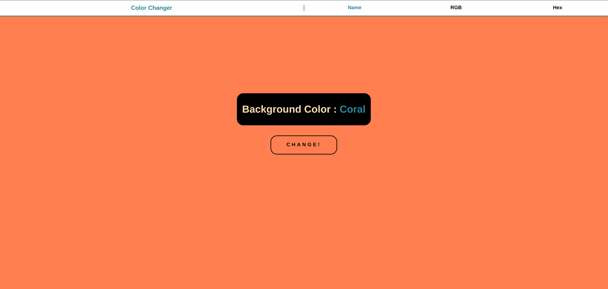

# COLOR PROJECT

## FULLSTACK PRACTICE PROJECT NO: 1

1. A fullstack version of my previous frontend project to practice my skills using Javascript, NodeJS, ExpressJS, HTML, CSS.

2. It changes the background color of page by click.

3. From top you can choose one of the options to see the background color by name, rgb or hex.
